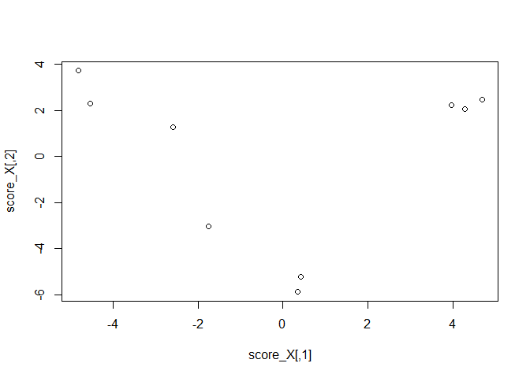

PLS-ROGの計算(デモデータ)
================

### 準備

>   - pls-rogの関数を読み込む
>   - デモデータ(variable × sample)を読み込むんで、sample × variableの行列に転置する

``` r
source("https://raw.githubusercontent.com/hiroyukiyamamoto/pls-rog/master/plsrog.R")
load(file="C:/Users/yamamoto/Documents/GitHub/pls-rog/demo.Rdata")
X <- t(Z$X) # sample*variable
```

### PLS-ROGの計算と結果

>   - 引数は、データ行列、群情報、平滑化パラメーターの順に設定する
>   - score\_XがPLS-ROGのスコア
>   - Rはscore\_Yとデータ行列Xの各変数の相関係数(PLS-ROG loading)
>   - Pは各列がそれぞれの成分のPLS-ROG loadingのp-value

``` r
plsrog <- plsrog(X, Z$Y, 0.999)

score_X <- plsrog[[1]] # score for X
score_Y <- plsrog[[2]] # score for Y
Wx <- plsrog[[3]] # weight vector for X
Wy <- plsrog[[4]] # weight vector for Y
R <- plsrog[[5]] # factor loading for X
P <- plsrog[[6]] # p-value of factor loading for X

plot(score_X)
```

<!-- -->
